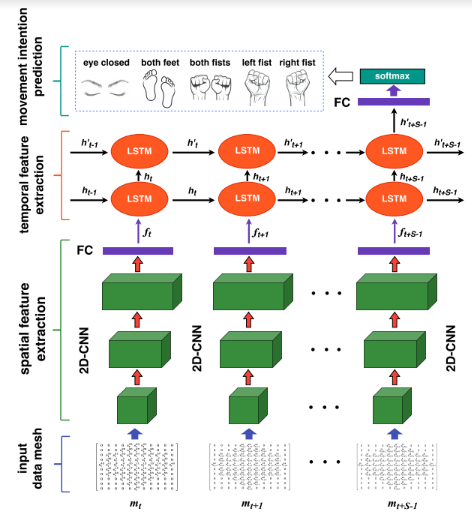
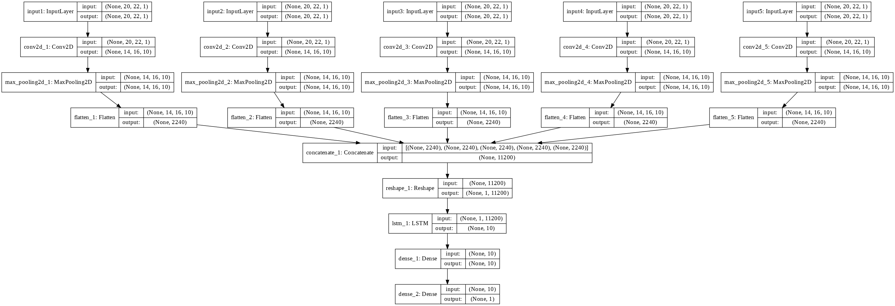
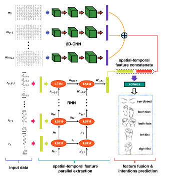
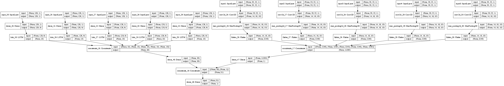
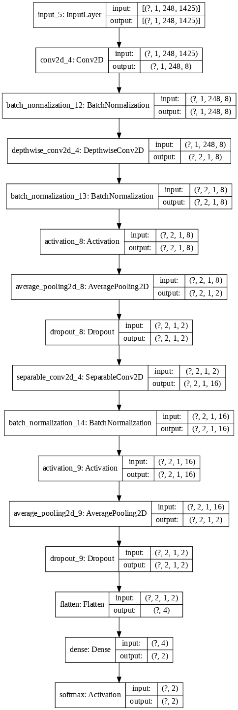

# Decoding Brain Data using Deep Learning techniques

This project aims at using deep learning techniques to do brain data classification.
The data used is Magnetoencephalography (MEG) data made available by [The Human Connectome Project](http://www.humanconnectomeproject.org/ "Human Connectome Project Homepage")  and available at [this address](https://www.db.humanconnectome.org) . 

We are first interested into classifying whether a subject is in rest state or in a working state.

Our second goal is to do a multi-class classification: which specific task the subject is doing ?

Some future improvements will include transfer learning and domain adaptation.

Four neural network architectures are being investigated:

## Cascade CNN + LSTM

The architecure has been presented in this [paper](https://www.researchgate.net/publication/321099072_Cascade_and_Parallel_Convolutional_Recurrent_Neural_Networks_on_EEG-based_Intention_Recognition_for_Brain_Computer_Interface) through the following schema:

Its corresponding keras model is the following:

## Parallel CNN + LSTM

This one is coming from the same paper cited above, its schema is :

Its corresponding model is:

## EEGNet

Based on the model available in the following [github repository](https://github.com/vlawhern/arl-eegmodels)

Its model is:

## Capsule Networks

Based on the model presented in [this paper](https://www.researchgate.net/publication/333070884_Emotion_Recognition_from_Multiband_EEG_Signals_Using_CapsNet)

